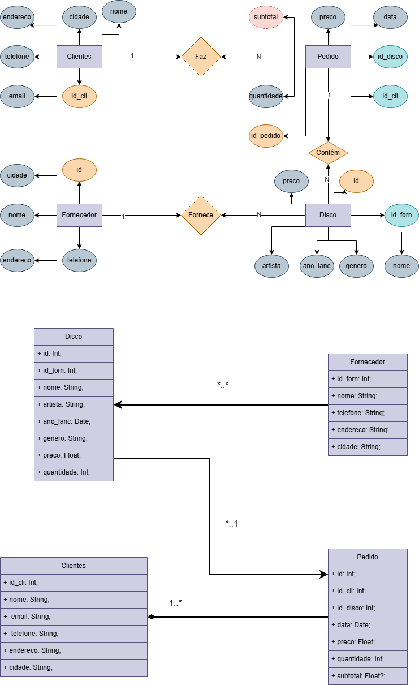

# TCC (Trabalho de Conclusão de Curso)
Em processo de desenvolvimento

## Integrantes
* Pedro Duarte

## Instituição e Curso

Projeto desenvolvido com o intuito educacional dos alunos de Desevolvimento de Sistemas - SENAI Jaguariúna 

## Ideia do Projeto e Metodologia

Loja de venda de discos online, com carrinho e função de vender seus proprios discos. A metodologia seguida no projeto sera a XP.

## Requisitos funcionais 
- [RF001] O sistema deve permitir o CRUD de clientes.
- [RF002] O sistema deve permitir que a compra de disco.
- [RF002.1] O sistema deve permitir o cliente adicionar mais de um produto no carrinho.
- [RF002.2] O sistema deve permitir o cliente retirar mais de um produto no carrinho.
- [RF003] O sistema deve permitir o CRUD de fornecedores.

## Tecnologias Utilizadas para o Desenvolvimento

| Linguagens e Ferramentas  | Funcionalidade |
| ------------- |:-------------:|
| [HTML](https://html.spec.whatwg.org/multipage/) | Modelo     |
| [CSS](https://www.w3.org/Style/CSS/Overview.en.html)    | Visão |
| [JavaScript (Vanilla)](https://262.ecma-international.org/)  | Controle |
| [ORM Prisma](https://262.ecma-international.org/)  | Ferramenta de source que auxilia banco de dados |
| [Vscode](https://code.visualstudio.com/)    | IDE (Ambiente integrado de desenvolvimento) |
| [Insomnia](https://insomnia.rest/download)   | Testar, criar e simular APIs |
| [NodeJS](https://nodejs.org/pt)    | Interpretar codigos em JavaScript (Vanilla) |
| [XAMPP](https://www.apachefriends.org/pt_br/index.html)    | Software que gera um servidor web local (Banco de Dados) |
| [Git](https://git-scm.com/downloads)    | Ferramenta colaborativa de versionamento |

## Github dos Desenvolvedores

* [Pedro Duarte](https://github.com/PedroDNRusso)

## Github dos Professores

* [Wellington Fábio de Oliveira Martins](https://github.com/wellifabio)
* [Lucas Paiva](https://github.com/lucasPaiva00)
* [Luís Fernando](https://github.com/luisfernandospoljaric)
* [Reenye Lima](https://github.com/ReenyeLima)
* [Robson Souza](https://github.com/robsonbsouzaa)

## Canvas e Cronograma

* [Canvas](https://wellifabio.github.io/canvas/)
* [Cronograma](https://wellifabio.github.io/gantt/)

## Wireframes

## Progresso de Desenvolvimento

| Data  | Alterações |
| ------------- |:-------------:|
| 03/05/2025     | Começo do Projeto     |
| 04/05/2025     | Desenvolvimento de Pagina Inicial e Cadastro (Front-End)     |

## ByPedroDuarte